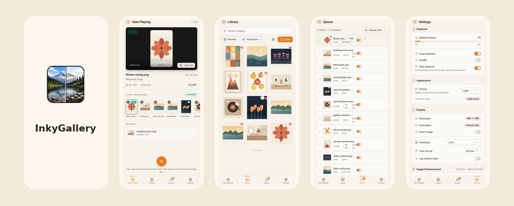

# InkyGallery

InkyGallery is a local-network image library and playback controller for the [Pimoroni Inky Impression](https://shop.pimoroni.com/products/inky-impression?variant=55186435244411) e-ink display. It gives you a mobile-first web UI for uploads, queue management, preview/apply flows, persistent crop editing, and device tuning. The webapp ships with full PWA support, including an installable manifest, homescreen icons, standalone display mode, and a service-worker-cached app shell.



The repo includes:

- a Python backend for assets, queueing, playback state, crop persistence, device settings, and Inky rendering
- a React/Vite frontend served by the backend as a single app
- concise current-state docs in [`docs/`](docs/)

## Run

Local development without hardware:

```bash
uv sync
cd inky-gallery-ui && pnpm install && pnpm build
cd ..
INKY_SKIP_HARDWARE=1 uv run python run.py
```

On a real Inky device:

```bash
uv sync --extra hardware
cd inky-gallery-ui && pnpm install && pnpm build
cd ..
uv run python run.py
```

The app serves the UI and API from the same process on `http://localhost:8080` by default. When you open it from a phone on the same network, it can be installed like a native app and launched in standalone PWA mode.

## Attribution

InkyGallery is inspired by [InkyPi](https://github.com/fatihak/InkyPi). Parts of the backend image-loading and Inky hardware communication path were copied or adapted from that codebase.

Built by Codex ❤️