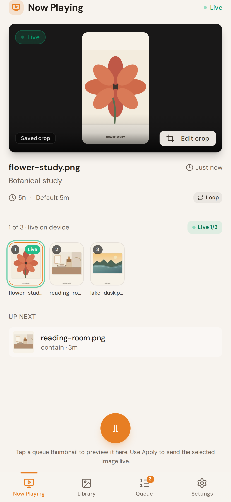
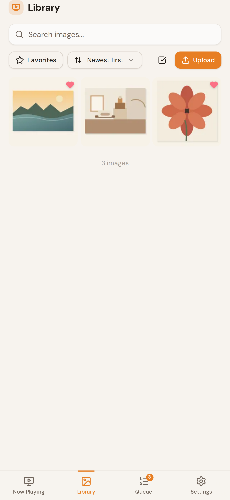
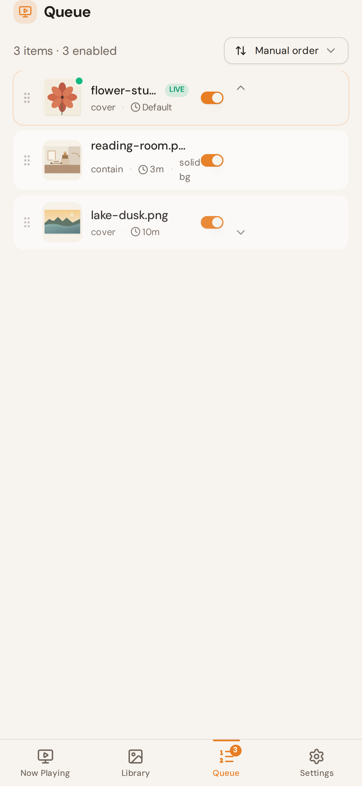
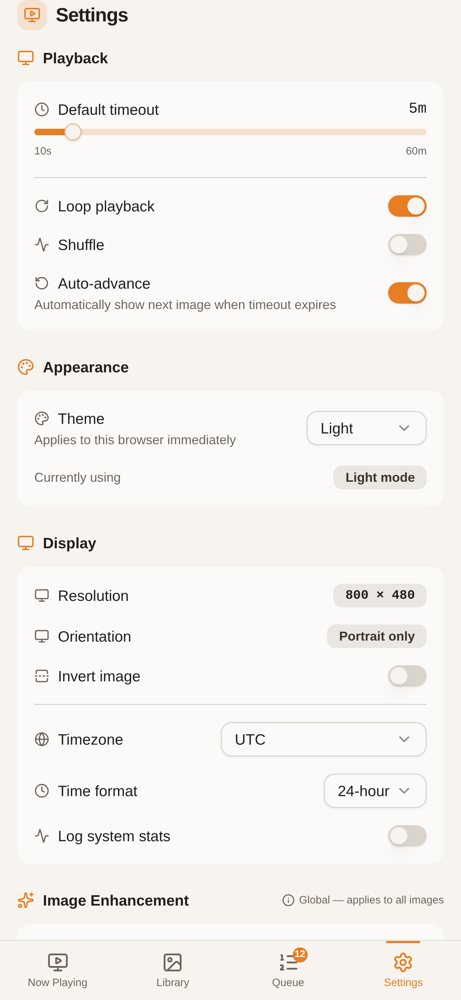

# InkyGallery

InkyGallery is a local-network image library and playback controller for Pimoroni Inky e-ink displays. It gives you a mobile-first web UI for uploads, queue management, preview/apply flows, persistent crop editing, and device tuning.

<p>
  
  
</p>
<p>
  
  
</p>

The repo includes:

- a Python backend for assets, queueing, playback state, crop persistence, device settings, and Inky rendering
- a React/Vite frontend served by the backend as a single app
- concise current-state docs in [`docs/`](docs/)

## Run

Local development without hardware:

```bash
uv sync
cd inky-gallery-ui && pnpm install && pnpm build
cd ..
INKY_SKIP_HARDWARE=1 uv run python run.py
```

On a real Inky device:

```bash
uv sync --extra hardware
cd inky-gallery-ui && pnpm install && pnpm build
cd ..
uv run python run.py
```

The app serves the UI and API from the same process on `http://localhost:8080` by default.

## Attribution

InkyGallery is inspired by [InkyPi](https://github.com/fatihak/InkyPi). Parts of the backend image-loading and Inky hardware communication path were copied or adapted from that codebase.
